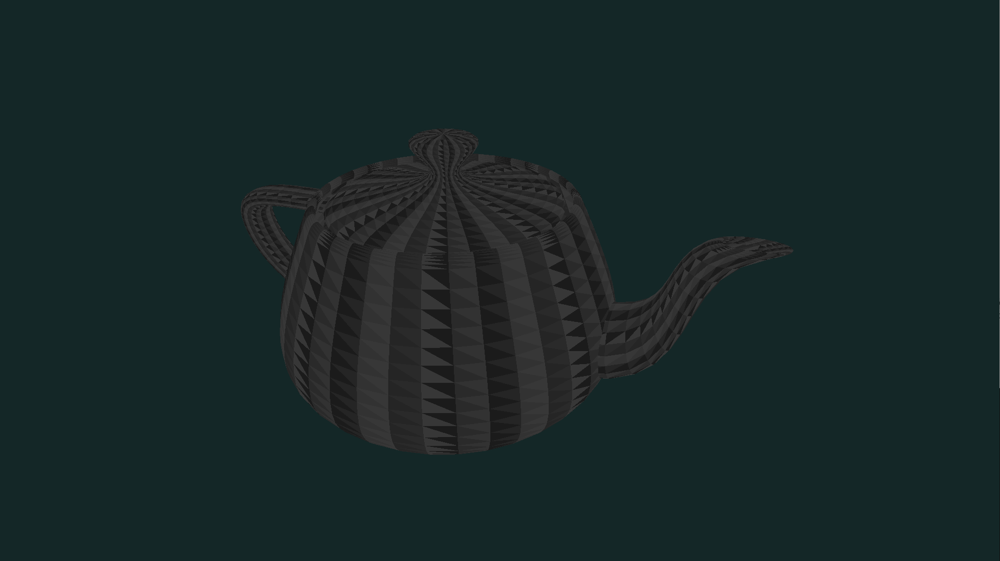
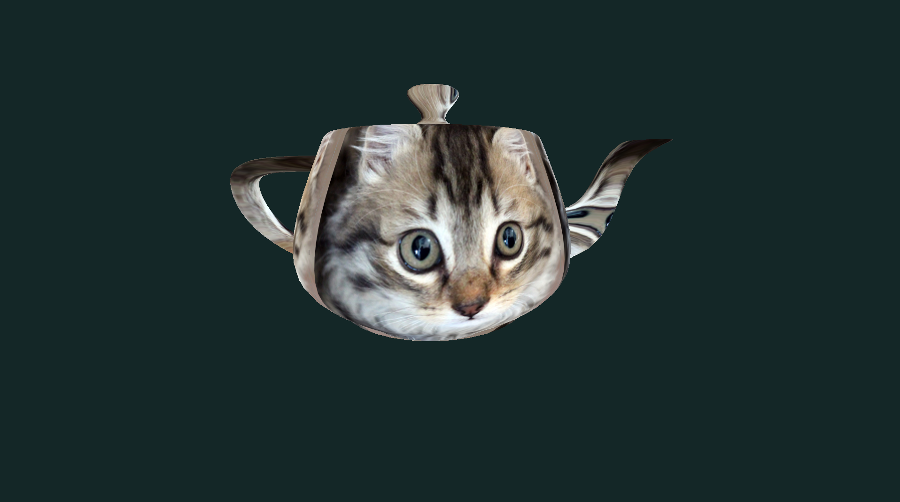
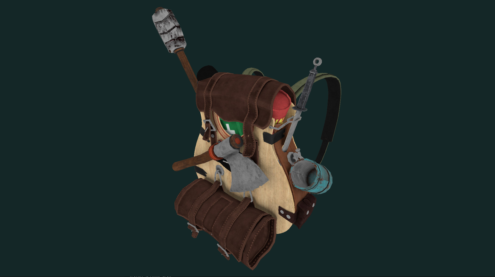

<h1>SCOP</h1> 
 

<h2>Description</h2>

This project is an introduction to OpenGL. The objective is to create an app capable of rendering 3D wavefront obj file, and of applying them textures by using C and OpenGL. 

Subject: [here](./fr.subject.pdf) 

<h2>Installation</h2> 
 

Requirements: `OpenGL version >= 3.3`. 

You must install the following dependency : `glfw 3.3.2`. 

 

`make install_glfw` 
`make` 
 

You can now run scop. :)
 

<h2>Optionnal Parameters</h2> 

`-v or --version :` Set OpenGL version. Default: 4.1. Available versions: 3.3, 4.0, 4.1, 4.2, 4.3, 4.4, 4.5, 4.6  
`-w or --width <int> :` Set the window width. (min: 320, max: 15360)  
`-h or --height <int> :` Set the window height. (min: 240, max: 8460) 
`-f or --fullscreen :` Fullscreen mode. 
`-t or --texture <name_texture> :` Set the texture by typing the name of the file you want to use (the texture must be in .bmp format and in contents/textures folder). 
`--r or --refresh-rate <int> :` Overwrite refresh rate (MIN:24, MAX: 240, Default: Monitor refresh rate) 

<h2>Mandatory Parameters</h2> 

`obj`: Path to Wavefront .obj file 

<h2>Controls</h2> 

Basic keys: 
    - `Escape`: Quit the program. 
    - `Mouse`: Use left click to change cam position. 
    - `ZQSD & Arrow keys`: Move object. 
    - `Scroll`: zoom/unzoom 
Texture & color keys: 
    - `t`: Activate texture 
    - `KP 1 to 3`: Set texture map algo: cubic, spheric, cylindrical 
    - `KP 4 to 6`: Set color type 
    - `KP 7`: Use obj vt mapping 
    - `KP 8`: Flip custom texture 
    - `KP 9`: Use custom texture 
    - `k`: Use default kitty texture 
Special keys: 
    - `KP *`: Sleep rotation 
    - `r`: Reset cam & object positions 

<h2>Examples</h2>  

- without vt mapping in obj file: 
`./scop Contents/Resources/obj/teapot2.obj` 

 

You can press `t` to apply a kitty texture using texture mapping algorithms (can be changed with KP 1 to 3). You can for example use a smooth texture like `bronze.bmp` to get a better render! 

 

- With vt mapping in obj file: 
`./scop Contents/Resources/obj/backpack.obj -t diffuse.bmp`, Then press `t` to activate texture, then `KP 7` to use vt mapping described in the obj file, then `KP 8` to flip the texture (some obj need the texture to be flipped.). 

 

<h2>Grade</h2>

`125/100`